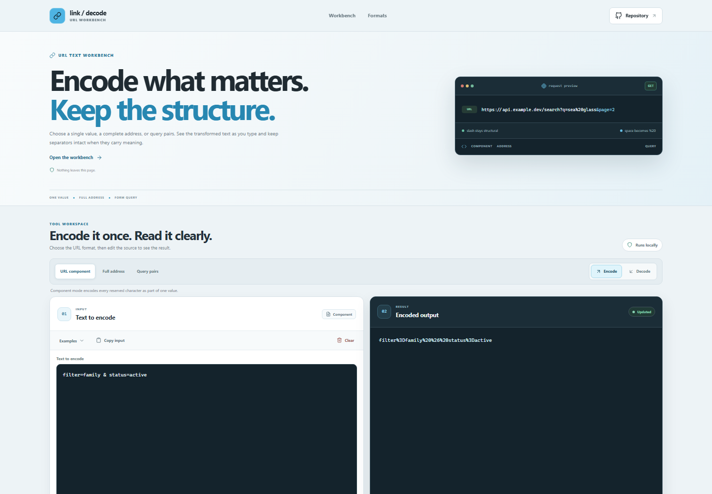



# URL Encoder and Decoder

A browser-based utility for encoding and decoding URL components, complete addresses, and query strings. Use it to inspect URL text, prepare values for links or API requests, and understand how different URL formats handle reserved characters and spaces.

**Live app:** [https://a2rp.github.io/url-encoder-decoder/](https://a2rp.github.io/url-encoder-decoder/)

## What you can do

- Switch between URL component, full address, and query pairs modes.
- Encode or decode text as you type. The output updates immediately and explains the selected format.
- Load practical examples from the input panel. Loading an example asks before replacing your current text.
- Copy either the input or output, with a status message confirming the result.
- Clear the current input after confirming the action.
- Read errors for malformed percent escapes, invalid JSON, unsupported formats, and oversized input.
- Use the tool on mobile or desktop. The header stays visible, and the back-to-top control appears after scrolling.

## URL formats

**URL component** uses `encodeURIComponent` and `decodeURIComponent`, treating the input as one value and escaping reserved URL characters.

**Full address** uses `encodeURI` and `decodeURI`, preserving characters that make up URL structure, such as slashes, query separators, and anchors.

**Query pairs** uses `URLSearchParams`, so spaces encode as plus signs. To encode, enter a JSON object or an array of `[key, value]` pairs. Use the array form to keep repeated keys, for example `[["tag", "blue"], ["tag", "green"]]`. Decoding accepts a query string with or without a leading `?` and returns an ordered JSON array of pairs, preserving duplicates.

## Privacy and limits

All transformations run in your browser. The app does not upload or save input, output, or examples. Clipboard buttons use the browser clipboard API and may require a secure context or browser permission. Input is limited to 100,000 characters.

## Run locally

Requires Node.js and npm.

```sh
npm install
npm run dev
```

Run the available checks and create a production build with:

```sh
npm test
npm run lint
npm run build
```

Deploy the built site to GitHub Pages with:

```sh
npm run deploy
```

## Future improvements

These are ideas for future versions and are not implemented yet:

- Add shareable examples for common API and form-encoding cases.
- Add a side-by-side character diff for encoded output.
- Add optional line-by-line batch processing.

## Links

- Portfolio: [https://www.ashishranjan.net](https://www.ashishranjan.net)
- GitHub: [https://github.com/a2rp](https://github.com/a2rp)
- CodePen: [https://codepen.io/ash1198](https://codepen.io/ash1198)
- LinkedIn: [https://www.linkedin.com/in/aashishranjan](https://www.linkedin.com/in/aashishranjan)
- Facebook: [https://www.facebook.com/theash.ashish/](https://www.facebook.com/theash.ashish/)
- YouTube: [https://www.youtube.com/@ashishranjan-ashz?sub_confirmation=1](https://www.youtube.com/@ashishranjan-ashz?sub_confirmation=1)
- Email: [mailto:ash.ranjan09@gmail.com](mailto:ash.ranjan09@gmail.com)

## Support

- Support: [https://a2rp-donation-page.netlify.app/](https://a2rp-donation-page.netlify.app/)
- Buy Me a Coffee: [https://buymeacoffee.com/ashishranjan](https://buymeacoffee.com/ashishranjan)
- Patreon: [https://www.patreon.com/ashishranjan](https://www.patreon.com/ashishranjan)
